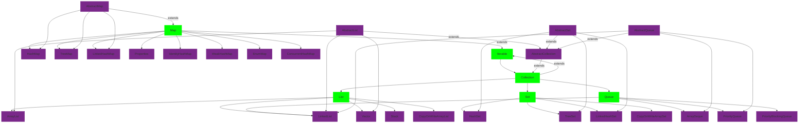

# flutetr_web_testing

A new Flutter project.

```mermaid
graph TD
    classDef Interface fill:#00FF00,stroke:#00FF00,stroke-width:2px
    classDef Class fill:#7A288A,stroke:#7A288A,stroke-width:2px

    Iterable:::Interface --> Collection:::Interface
    Collection:::Interface -->|extends| Iterable
    Collection:::Interface --> List:::Interface
    Collection:::Interface --> Set:::Interface
    Collection:::Interface --> Queue:::Interface
    Map:::Interface -->|extends| Iterable

    List:::Interface --> ArrayList:::Class
    List:::Interface --> LinkedList:::Class
    List:::Interface --> Vector:::Class
    List:::Interface --> Stack:::Class
    List:::Interface --> CopyOnWriteArrayList:::Class

    Set:::Interface --> HashSet:::Class
    Set:::Interface --> TreeSet:::Class
    Set:::Interface --> LinkedHashSet:::Class
    Set:::Interface --> CopyOnWriteArraySet:::Class

    Queue:::Interface --> LinkedList:::Class
    Queue:::Interface --> ArrayDeque:::Class
    Queue:::Interface --> PriorityQueue:::Class
    Queue:::Interface --> PriorityBlockingQueue:::Class

    Map:::Interface --> HashMap:::Class
    Map:::Interface --> TreeMap:::Class
    Map:::Interface --> LinkedHashMap:::Class
    Map:::Interface --> Properties:::Class
    Map:::Interface --> IdentityHashMap:::Class
    Map:::Interface --> WeakHashMap:::Class
    Map:::Interface --> EnumMap:::Class
    Map:::Interface --> ConcurrentHashMap:::Class

    AbstractCollection:::Class -->|extends| Collection
    AbstractList:::Class -->|extends| AbstractCollection
    AbstractSet:::Class -->|extends| AbstractCollection
    AbstractQueue:::Class -->|extends| AbstractCollection
    AbstractMap:::Class -->|extends| Map

    AbstractList:::Class --> ArrayList:::Class
    AbstractList:::Class --> LinkedList:::Class
    AbstractList:::Class --> Vector:::Class

    AbstractSet:::Class --> HashSet:::Class
    AbstractSet:::Class --> TreeSet:::Class
    AbstractSet:::Class --> LinkedHashSet:::Class

    AbstractQueue:::Class --> LinkedList:::Class
    AbstractQueue:::Class --> ArrayDeque:::Class
    AbstractQueue:::Class --> PriorityQueue:::Class

    AbstractMap:::Class --> HashMap:::Class
    AbstractMap:::Class --> TreeMap:::Class
    AbstractMap:::Class --> LinkedHashMap:::Class
```
